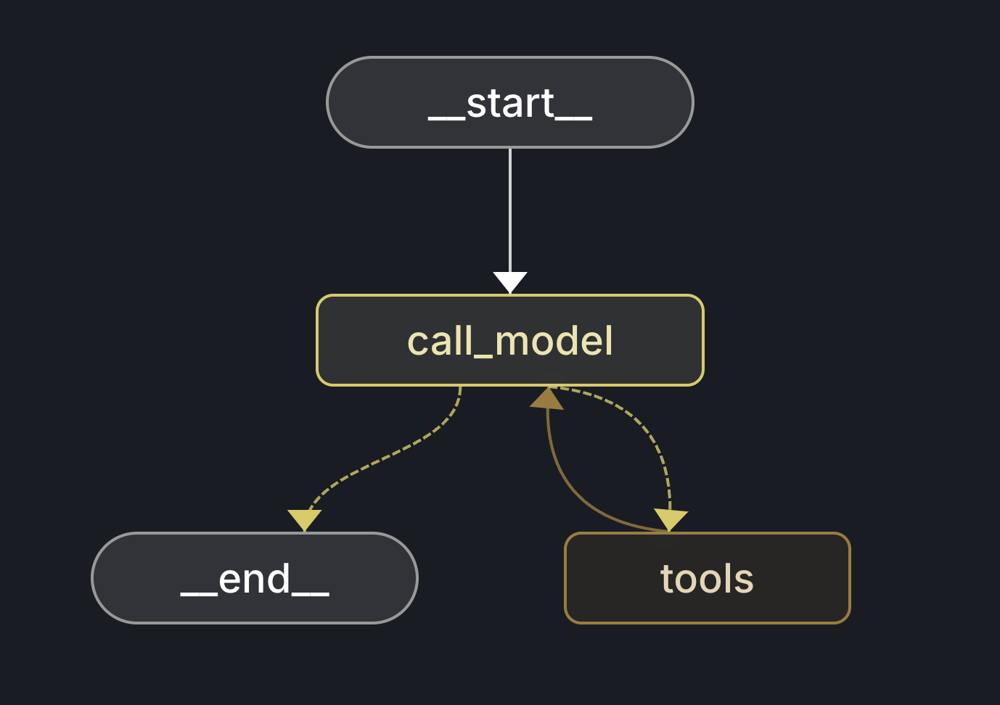

# LangGraph AI Agent

This is a proof of concept for a LangGraph AI Agent. Essentially we are using LangGraph to define the workflow of the agent and then we are using FastAPI to expose a websocket endpoint for the client to interact with the agent.

The agent is composed of the graph with containing Tools and LLM nodes. it begins by asking the LLM to perform the reasoning and once the LLM has performed the reasoning, it will call the Tools to get the data. Once the Tools have been called, the agent will call the LLM again to perform the reasoning again with the new data. This process repeats until the agent has performed the reasoning enough times or the LLM has run out of tokens.



## Install Dependencies

```sh
make install
```

## Run the server

```sh
make run
```

## Start LangGraph Server

Make sure to install LangGraph dependencies first.

```sh
pip install --upgrade "langgraph-cli[inmem]"
```

or if using MAC:

```sh
brew install langgraph-cli
```

Run LangGraph server

```sh
make langgraph
```

## Run server with docker

```sh
cd server
docker build -t ai-chat-server .
docker run -p 8000:8000 -e OPENAI_API_KEY=your_key_here ai-chat-server
```

## Push to docker hub

```sh
docker tag ai-chat-server your_dockerhub_username/ai-chat-server
docker push your_dockerhub_username/ai-chat-server
```
