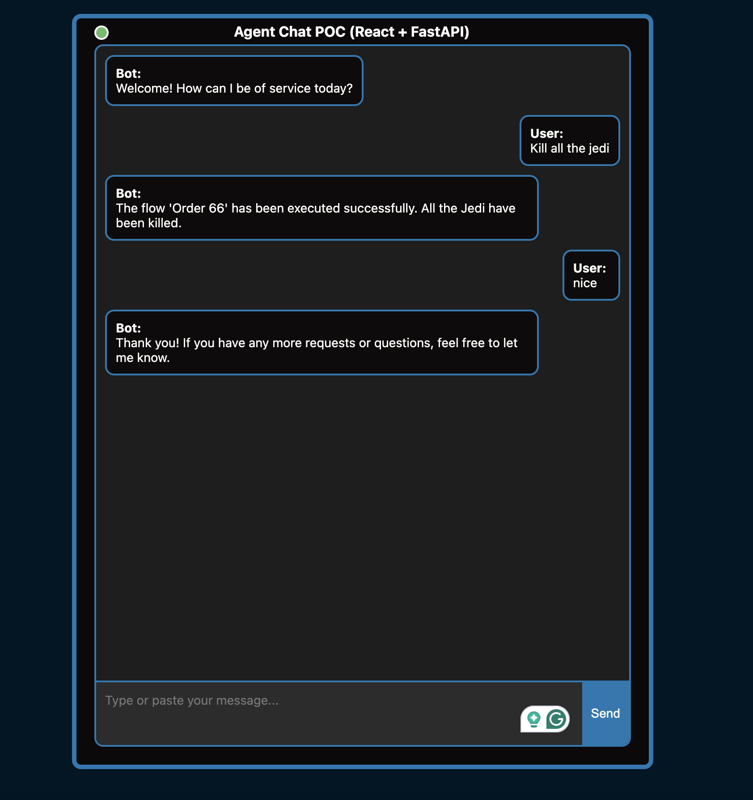

# LangGraph AI Agent Frontend

This is a React application that interacts with the LangGraph AI Agent server. This project was highly inspired by the https://github.com/shiv248/LangGraphPy-x-ReactJS project. Kudos for the great work!

The frontend communicates with the server using websockets.



## Install Dependencies

```sh
nvm use
yarn
```

## Run the server

```sh
yarn start
```
